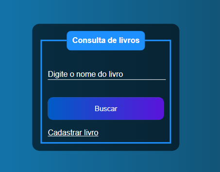

# Desafio Criação de sistema de cadastro de livros, Versão com o Node-js !

O projeto é a versão em nodejs da aplicação de cadastro de livros contruida anteriormente em Larável-PHP.

## 🚀 Tecnologias

Esse projeto foi desenvolvido com as seguintes tecnologias:

- HTML e CSS
- JavaScript e JSON
- [Node e NPM](https://nodejs.org/)
- [Prisma](https://www.prisma.io)
- [Next-js](https://nextjs.org)
- [Docker](https://www.docker.com)
- [Docker-composer](https://docs.docker.com/get-started/08_using_compose/)

__________________________________________________________________

### ..........🚧🚧 Projeto em construção! 🏗 👷 🧱🚧..........
_______________________________________________________________
## O layout do pojeto:

  

